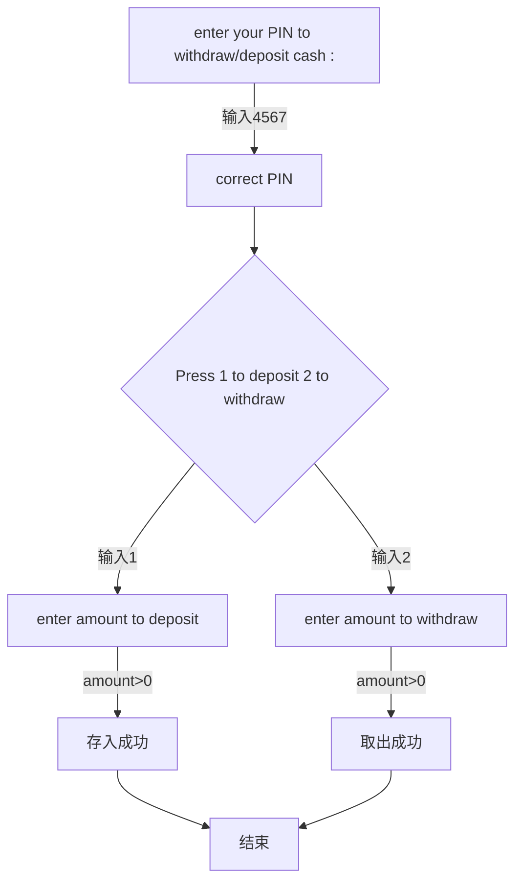

```mermaid
graph TD
A[enter your PIN to withdraw/deposit cash :]-->|输入4567| B[correct PIN]
B-->C{Press 1 to deposit 2 to withdraw}
C-->| 输入1| D[enter amount to deposit]
C-->|输入2| E[enter amount to withdraw]
D-->| amount>0|F[存入成功]
E-->|amount>0|G[取出成功]
F-->H[结束]
G-->H[结束]
```
