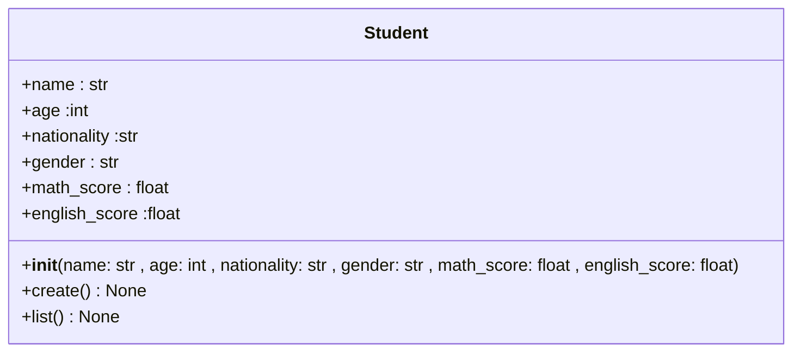

```mermaid
classDiagram
     class Student{
        +name : str
        +age :int
        +nationality :str
        +gender : str
        +math_score : float
        +english_score :float
        +__init__(name: str , age: int , nationality: str , gender: str , math_score: float , english_score: float)
        +create() None
        +list() None
     }    
```