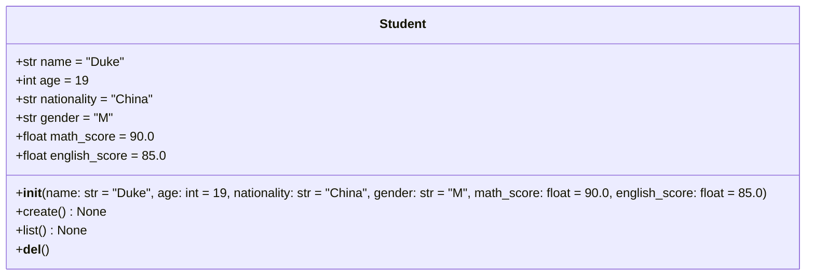

```mermaid
classDiagram
     class Student{
        +str name = "Duke"
        +int age = 19
        +str nationality = "China"
        +str gender = "M"
        +float math_score = 90.0
        +float english_score = 85.0
        +__init__(name: str = "Duke", age: int = 19, nationality: str = "China", gender: str = "M", math_score: float = 90.0, english_score: float = 85.0)
        +create() None
        +list() None
        +__del__()
     }    
```