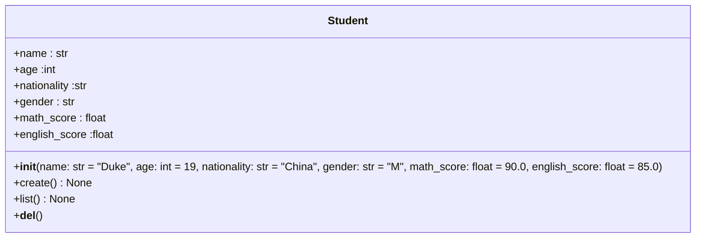

```mermaid
classDiagram
     class Student{
        +name : str
        +age :int
        +nationality :str
        +gender : str
        +math_score : float
        +english_score :float
        +__init__(name: str = "Duke", age: int = 19, nationality: str = "China", gender: str = "M", math_score: float = 90.0, english_score: float = 85.0)
        +create() None
        +list() None
        +__del__()
     }    
```