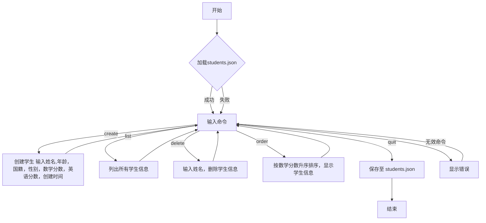

```mermaid
graph TD
A[开始] --> B{加载students.json}
B -->|成功| C{输入命令}
B -->|失败| C[输入命令]
C -->|create| E[创建学生 输入姓名,年龄，国籍，性别，数学分数，英语分数，创建时间]
C-->|list| F[列出所有学生信息]
C-->|delete| G[输入姓名，删除学生信息]
C-->|order| H[按数学分数升序排序，显示学生信息]
C-->|quit| I[保存至 students.json]
C-->|无效命令| J[显示错误]
E --> C
F --> C
G --> C
H --> C
J --> C
I --> K[结束]
```